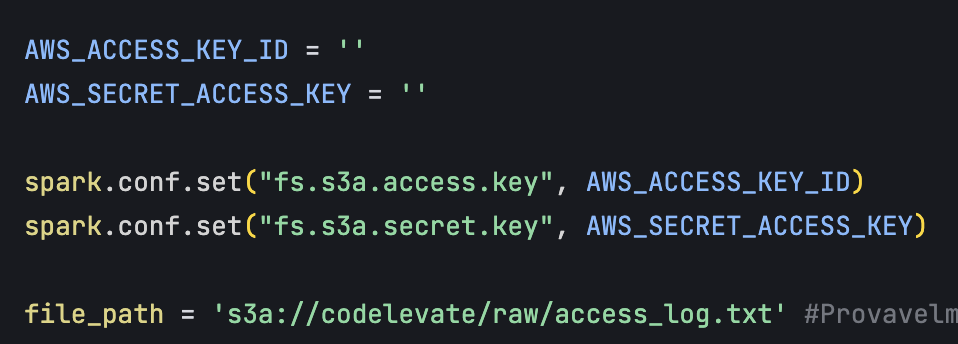

# 📊 Análise de Logs Web com Apache Spark 🚀

Projeto para o Code Elevate

## 📜 Sumário

*   [Visão Geral do Projeto](#-visão-geral-do-projeto)
*   [🎯 Desafio](#-desafio)
*   [🛠️ Tecnologias Utilizadas](#️-tecnologias-utilizadas)
*   [⚙️ Configuração do Ambiente (Docker)](#️-configuração-do-ambiente-docker)
*   [▶️ Executando o Projeto](#️-executando-o-projeto)
*   [📂 Estrutura do Projeto](#-estrutura-do-projeto)
*   [📝 Resultados Esperados](#-resultados-esperados)
*   [💡 Seção Opcional: Armazenamento dos Logs](#-seção-opcional-armazenamento-dos-logs)
*   [🤝 Contribuições](#-contribuições)
*   [👨‍💻 Autor](#-autor)

## 🌐 Visão Geral do Projeto

Este projeto foi desenvolvido como parte de um desafio de Engenharia de Dados. O objetivo principal é analisar um arquivo de log de acesso de servidor web (padrão Web Server Access Log) para responder a perguntas específicas sobre padrões de uso, origens de acesso, endpoints mais visitados, entre outros. A ferramenta central para o processamento dos dados é o Apache Spark, rodando em um ambiente Dockerizado e Databricks, onde construí as duas soluções possíveis, uma para cada caso que falarei mais adiante.

**Não é preciso rodar ambos, dê preferência ao Docker.**

Ponto importante: Ele utilizar .jars do Maven relacionadas ao S3 da AWS.

## 🎯 Desafio

O projeto visa responder às seguintes questões com base na análise dos logs:

1.  🥇 **Identificar as 10 maiores origens de acesso (Client IP)** por quantidade de acessos.
2.  🚪 **Listar os 6 endpoints mais acessados**, desconsiderando aqueles que representam arquivos.
3.  👤 **Qual a quantidade de Client IPs distintos?**
4.  🗓️ **Quantos dias de dados estão representados no arquivo?**
5.  💾 **Análise do tamanho (em bytes) do conteúdo das respostas:**
    *   Volume total de dados retornado.
    *   Maior volume de dados em uma única resposta.
    *   Menor volume de dados em uma única resposta.
    *   Volume médio de dados retornado.
6.  🚨 **Qual o dia da semana com o maior número de erros do tipo "HTTP Client Error"?**

## 🛠️ Tecnologias Utilizadas

*   
*   
*   
*   
*    


## ⚙️ Configuração do Ambiente (Docker)

Para rodar este projeto localmente utilizando Docker, siga os passos abaixo:

1.  **Clone o Repositório:**
    ```bash
    git clone https://github.com/gabealves-jpg/code-elevate-assignment.git
    cd code-elevate-assignment/docker-solution
    ```

2.  **Pré-requisitos:**
    *   Certifique-se de ter o [Docker](https://docs.docker.com/get-docker/) instalado e em execução na sua máquina.

3.  **Variáveis de Ambiente:**
    *   Para rodar esse script, é necessário setar as variáveis de ambiente AWS_ACCESS_KEY_ID, AWS_SECRET_ACCESS_KEY que foram enviadas por e-mail. Abra um terminal e execute:
      ```env
      export AWS_ACCESS_KEY_ID=''
      export AWS_SECRET_ACCESS_KEY='''
      ```
    * OU: Aponte para o access_log que você possuir no ínicio do script em main_docker.py

## ▶️ Executando o Projeto (Docker)

No mesmo terminal que foi setada a variável de ambiente e com o Docker e Docker Compose devidamente configurados execute o seguinte comandos:

```bash
docker-compose up --build
```

## ⚙️ Configuração do Ambiente (Databricks)
Caso queira rodar o projeto utilizando o Databricks, siga os passos abaixo:

1.  **No Databricks você pode: clonar o repositório, ou importar os arquivos diretamente na sua workspace;**

2.  **Utilize o arquivo de log no S3 ou configure os caminhos necessários para o notebook 'main_dtb':**
    *   **Caminho do arquivo de log (`access_log`):** Você pode definir uma variável com as keys (conforme enviado por e-mail) OU modificar diretamente a variável `file_path` no início do script `main_dtb.ipynb` para apontar para o seu arquivo de log.
    Databricks:
    
    Docker: 
    
    *   **Caminho de saída no S3:** Ainda assim, você DEVE definir a variável de ambiente correspondente (conforme enviado por e-mail) para que o notebook possa salvar os resultados no S3. Conforme abaixo:

2. **Sete as variáveis de ambiente no começo do notebook 'main_dtb', conforme enviado por e-mail. OU: Aponte para o access_log que você possuir no ínicio do script em main_dtb.ipynb (em file_path): Ainda assim, precisará da variável de ambiente para salvar no S3**


3. **Clique para executar tudo. Já está em ordem. Os resultados serão printados na tela**


## ▶️ Algumas observações:
- Decidi entregar duas soluções pois acredito que cada uma serve um caso diferente. A do Databricks é algo mais fixo numa plataforma e próximo do que o banco tem hoje, e eu não queria depender somente do Databricks. Há também outras formas de fazer deploy por lá usando um Workflow ou até um DLT, tudo orquestrado e tudo numa ferramenta só. Funciona completamente utilizando Unity Catalog  e tendo como storage soluções da AWS (S3, etc) e Azure (Blob Storage). Nesse caso, para estudar novos caminhos, utilizei o S3.

- Para a solução com Docker, acredito ser uma solução mais agnóstica de plataforma, por ser mais containerizada. Pensei em algumas soluções para armazenamento como:
    - Elasticsearch. Foi uma das minhas primeiras opções, porém acredito que estava adicionando complexidade ao projeto sem necessidade no momento. Seria ótimo para ter uma stack de visualização de dados com o Kibana, mas não tive tanto tempo para executar isso.
    - Considerei também um AWS RDS (Postgres) para armazenar os dados, mas no fim, não achei que um banco de dados relacional seria o melhor para armazenar essa log, apesar do log ser estruturado e essa solução parecer ser mais fácil que Elastic.
    - Por fim, decidi utilizar o S3, que poderia utilizar tanto no Databricks quando no Docker, e eu poderia abre oportunidades de conectar com o AWS, OpenSearch, Athena e mais uma infinidade de outras soluções. No fim, acabei de replicando o esquema de Lake do Databricks, mas acho que faz sentido para logs.

- Os resultados das perguntas estão salvas como .txt no *Databricks*. Pensei em subir para o S3 na solução do Docker, mas como *esse* S3 não estará facilmente acessível, decidi não prosseguir com essa parte.

